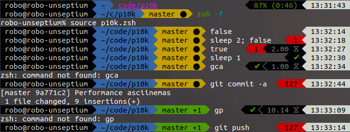

# ZINC

Inspired by Powerlevel9K, Agnoster, and friends this is a powerline theme written from scratch in pure ZSH. It supports mixed async segments using zsh-async as a backend.



ZINC is ZSH software, not just shell scripts. (See https://github.com/zdharma/Zsh-100-Commits-Club )

<!-- START doctoc generated TOC please keep comment here to allow auto update -->
<!-- DON'T EDIT THIS SECTION, INSTEAD RE-RUN doctoc TO UPDATE -->


- [Quickstart and Documentation](#quickstart-and-documentation)
- [Why ZINC?](#why-zinc)
- [Note about Icons and Symbols](#note-about-icons-and-symbols)
- [Performance](#performance)
- [GitLab vs GitHub](#gitlab-vs-github)

<!-- END doctoc generated TOC please keep comment here to allow auto update -->

## Quickstart and Documentation

Visit the GitLab / GitHub Wiki! There you'll find docs about how to install and configure ZINC.

If you're looking for the individual segment options, look in the `zsdoc` folder in this repo. Each segment has it's docs autogenerated by Zshelldoc.

## Why ZINC?

 - ZINC is configured and structured very differently from other themes
   - ZSH associations (/dictionaries) are used for almost all options
   - There's no central icon or segment registration
   - Segments are free to do as they please
 - ZINC is a very small and lean code base that's quick to load.
 - ZINC is easily extensible (works via shell functions and zsh's `fpath`)
 - ZINC is completely customizable (make your own segments with a standard API!)

ZINC was built to support mixed async and non-async segments from the ground up. Git/HG/SVN information is loaded asynchronously, so your prompt is usable near instantly even on slow systems!

Also, async segments are smart:

 - redrawing the prompt doesn't start duplicate jobs
 - async output can be cached differently per-segment
 - custom async segments are easy to implement (3 shell functions) and require no changes or calls to ZINC code

## Note about Icons and Symbols

If you're in it for the super-fancy icons from Nerd-Fonts, etc, Powerlevel9K is still a better choice as the advanced Icon registry and alternative font support is not present in ZINC by default.

Official ZINC segments will only use Unicode, UTF-8, and icons from the powerline patched fonts in order to both ease setup/configuration and simplify a lot of the code for speed.

Since it's supposed to be super easy to modify and make your own segments, we've left custom font icons up to the users for usage.

## Performance

 - Only functions that get used are loaded via ZSH's `fpath` autoload functionality
 - **There are no external calls in the main thread.** Program calls and shell forking is all done in an async worker.
 - Prompt segments can be compiled to ZSH word code for better startup time. (Just execute `prompt_zinc_compile`)
 - ZSH builtins and binary modules are used instead of GNU utils / external binaries.

Performance comparison: (Mar. 2019) using [zsh-prompt-benchmark](https://github.com/romkatv/zsh-prompt-benchmark)

ZINC:
```
************************************************************
                Prompt Benchmark Results
************************************************************
Warmup prompts (skipped)  5
Benchmarked prompts       1841
Total time                5.002s
Time per prompt           2.7ms
************************************************************
```

Powerlevel9K: https://github.com/bhilburn/powerlevel9k
```
************************************************************
                Prompt Benchmark Results
************************************************************
Warmup prompts (skipped)  5
Benchmarked prompts       28
Total time                5.037s
Time per prompt           179.9ms
************************************************************
```

Pure: https://github.com/sindresorhus/pure
```
************************************************************
                Prompt Benchmark Results
************************************************************
Warmup prompts (skipped)  5
Benchmarked prompts       3130
Total time                5.001s
Time per prompt           1.6ms
************************************************************
```

> All tests done with Git information enabled and with the same git repo state on a machine using an nvme SSD.

## GitLab vs GitHub

ZINC started on [GitLab](https://gitlab.com/robobenklein/zinc), but is mirrored to GitHub for availability purposes. Both the repo and the wiki are mirrored. (So `robobenklein/zinc` works in plugin managers with GitHub as the default.)

Issues should be reported on [GitLab](https://gitlab.com/robobenklein/zinc/issues), as it has a slightly better issue tracker and allows things like file attachments.
